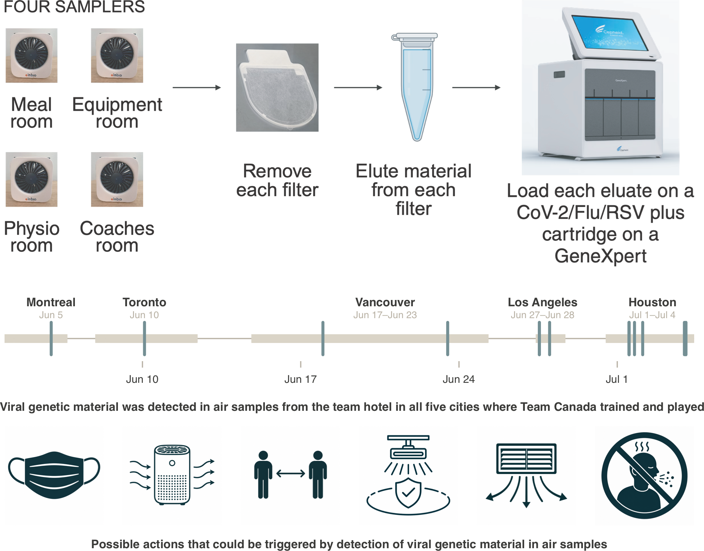
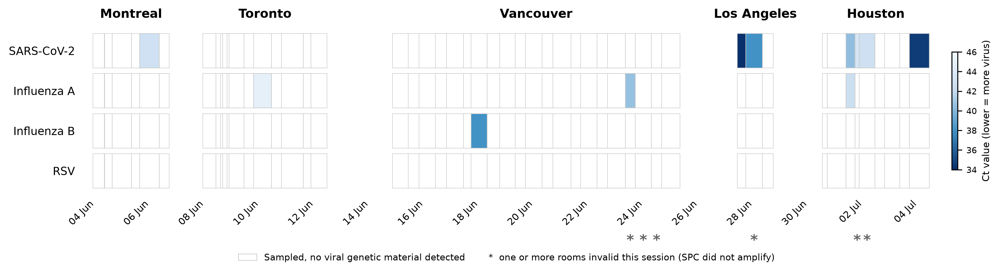
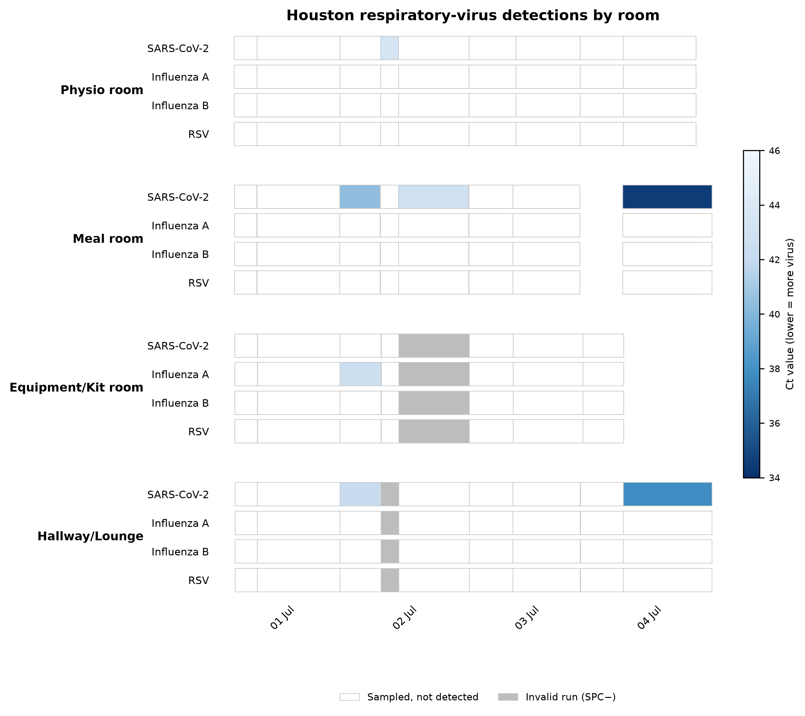
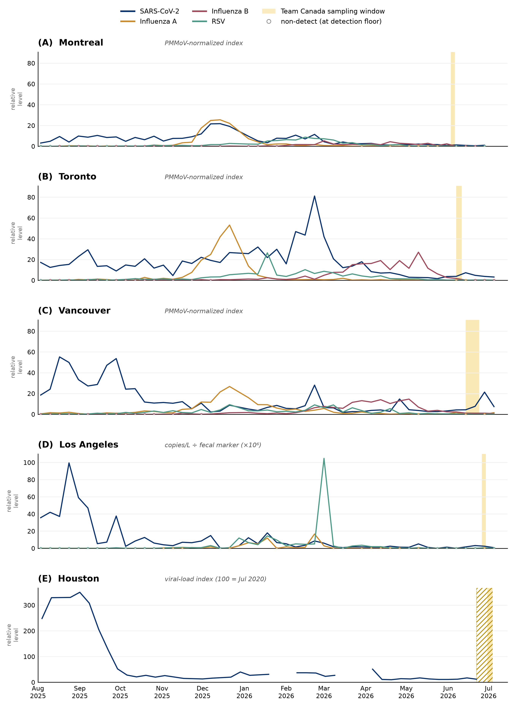

# Air sampling in team congregate spaces for early detection of respiratory virus threats

*Viral air sampling in team settings*

David Simon, Timothy Locksmith, Nick Minor, Eli J. O'Connor, Shelby L. O'Connor†, David H. O'Connor† (corresponding: dhoconno@wisc.edu)

† equal contribution

> **Private preview.** This is a static rendering of the manuscript for in-repo review while the interactive site is held back. Figures are the static (print) versions; the interactive Plotly figures appear on the GitHub Pages site once it is published. Auto-generated by `scripts/build_preview.py` — do not edit by hand; edit the Google Doc.

## Central figure

**Central figure. Air sampling for early detection of respiratory-virus threats
in an elite team during competition.** Continuous bioaerosol sampling ran in up
to four team congregate spaces per hotel (meal, equipment, physiotherapy, and
coaches' rooms); each cartridge's filter was eluted on-site and tested on a
Cepheid GeneXpert SARS-CoV-2/Flu/RSV cartridge (top). Across the five host
cities, viral genetic material was detected in team-hotel air in every city; the
timeline shows sampling coverage (band) and each detection (tick) over the
tournament (middle). A positive air signal can trigger low-regret responses —
masking, portable air purifiers, distancing and reduced occupancy, far-UVC,
reinforced ventilation, and excluding visibly ill personnel (bottom).

---

## Abstract

**Objective**. Respiratory infections are the leading cause of illness at major sporting events, yet surveillance relies on athletes recognising and reporting symptoms. We evaluated whether continuous air sampling with point-of-care molecular testing could detect respiratory-virus nucleic acids in an elite team's congregate spaces during competition, and whether the resulting signals were operationally useful.

**Methods**. Prospective, descriptive environmental-surveillance study following the Canadian men's national soccer team across five host cities during the 2026 FIFA World Cup™ (3 June–4 July 2026). InBio Apollo bioaerosol samplers ran continuously in up to four team-designated rooms per hotel (physiotherapy, meal, equipment, and coaches' room or hallway); cartridges were changed approximately twice daily, eluted on-site, and tested on the Cepheid Xpert® Xpress SARS-CoV-2/Flu/RSV assay. A sample was considered positive if any cycle-threshold (Ct) value was reported for a target, regardless of the instrument's qualitative call. Detections were summarised descriptively and related to the team's schedule and to events reported by medical staff.

**Results**. Of 182 cartridges, 15 yielded a detection (SARS-CoV-2, 11; influenza A, 3; influenza B, 1; RSV, none). Detections were sparse early and clustered late in the tournament. Three coincided with recognised events: an influenza A signal (Ct 44.9) appeared the morning a player was sent home febrile, and SARS-CoV-2 signals coincided with visibly ill hotel staff; signals fell after ill staff were excluded. Most detections had no identified clinical correlate.

**Conclusion**. Air sampling with point-of-care testing is feasible in the mobile environment of an elite team and can surface behaviour-independent viral signals during competition. 

## Summary Box

**What is already known on this topic**

Respiratory infections are the leading cause of illnesses at major sporting events, and conventional surveillance depends on athletes recognising and reporting symptoms, which misses pre-symptomatic, mild, and asymptomatic infections. Air sampling can detect respiratory viruses in congregate settings but has not been evaluated in elite team housing during competition.

**What this study adds**

Continuous air sampling with same-day point-of-care testing was feasible across a five-city World Cup campaign and detected SARS-CoV-2, influenza A, and influenza B in shared team spaces even during the low-circulation Northern-hemisphere summer, with several signals coinciding with a febrile player and with visibly ill staff.

**How this study might affect research, practice or policy**

Air sampling offers a candidate behaviour-independent early-warning signal that could allow teams to escalate precautions selectively rather than continuously. 

## Introduction

Acute respiratory illness is the most common non-injury medical problem in elite sport and is consistently the single largest illness category at major sporting events. At the FIFA World Cup Qatar 2022, respiratory infection accounted for 80% (12/15) of all time-loss illnesses among players [(Serner et al. 2025\)](https://paperpile.com/c/tA670F/58gc). Respiratory illness also comprised 64% of illnesses at the Lausanne 2020 Youth Winter Games and 50% at the Buenos Aires 2018 Youth Games [(Steffen et al. 2020](https://paperpile.com/c/tA670F/L6cE); [Palmer et al. 2021\)](https://paperpile.com/c/tA670F/GRgb). Work by scientists associated with Team Finland has repeatedly shown that elite athletes carry an elevated risk: at the 2019 Nordic World Ski Championships, athletes had roughly a sevenfold higher risk of symptomatic respiratory infection than exercising controls (38% vs 6%; relative risk 6.7, 95% CI 2.1–21.0) [(Valtonen et al. 2021\)](https://paperpile.com/c/tA670F/8rcK), and 45% of Team Finland athletes developed common cold symptoms during the 2018 PyeongChang Winter Olympics, with infections spreading readily within the team, most often within the same sport discipline [(Valtonen et al. 2019\)](https://paperpile.com/c/tA670F/Gkb0). Across one professional ice-hockey season, 93% of players experienced at least one acute respiratory infection and 34% of symptomatic players missed at least one game, with infections acquired both from the community and within the team [(Grönroos et al. 2026\)](https://paperpile.com/c/tA670F/Gkb0+grH9).

Shared housing, communal meals, travel, and crowded indoor spaces are repeatedly identified as risk factors [(Luoto et al. 2025; Ruuskanen et al. 2024\)](https://paperpile.com/c/tA670F/ZZEA+GyBy). Team hotels concentrate these hazards, gathering susceptible athletes and staff in a closed, shared-ventilation environment. There, athletes and staff can be exposed, by one another and by other hotel occupants, through inhalation of virus-laden aerosols that accumulate and travel beyond close range in poorly ventilated air, short-range exposure to larger droplets during face-to-face contact, and, less often, contact with contaminated surfaces [(Wang et al. 2021\)](https://paperpile.com/c/tA670F/q5Fs).

Symptom-triggered surveillance is behaviour-dependent, as infections are only ascertained when a person feels unwell, chooses to seek care or testing, and is correctly diagnosed. This misses or underestimates three situations where virus shedding could lead to outbreaks in team settings. The first is asymptomatic infections that are invisible to symptom-based monitoring but can still shed virus leading to transmission. Asymptomatic or subclinical infection is common across the viruses studied here: a meta-analysis of 55 studies estimated 19.1% of influenza infections as asymptomatic (21.0% for influenza A) and 43.4% as subclinical [(Furuya-Kanamori et al. 2016\)](https://paperpile.com/c/tA670F/1fDS), pooled estimates for SARS-CoV-2 cluster around 20% [(Buitrago-Garcia et al. 2022; Yu et al. 2022\)](https://paperpile.com/c/tA670F/8PrE+nDiv), and RSV frequently goes unrecognised, particularly in adults [(Walsh and Falsey 2012\)](https://paperpile.com/c/tA670F/Uerr). 

The second class are symptomatic infections that are never reported or are reported after onset of symptoms. In one community study, only 17% (95% CI 10–26) of PCR-confirmed influenza infections received medical attention [(Hayward et al. 2014\)](https://paperpile.com/c/tA670F/4XoM). Even with highly conditioned athletes attuned to their bodies and close monitoring from trainers, during one professional rugby tournament, symptoms were present for at least a day before being reported to the team physician in more than half of illnesses [(Schwellnus et al. 2012\)](https://paperpile.com/c/tA670F/DNps). In some cases, the incentive to keep competing works may work against disclosure of symptoms.

Third, for many respiratory viruses shedding, and probably transmission, begins before symptoms do. This pre-symptomatic window is short, on the order of a day or two, but it is precisely when an infected person is already seeding a shared space while still appearing well, and it is why symptom-based detection lags the true course of an outbreak. In experimental human influenza A(H3N2) infection, most shedding occurred one to two days after challenge whereas symptom severity did not peak until day 3 [(Han et al. 2019\)](https://paperpile.com/c/tA670F/1Xsr); in naturally acquired infection, influenza B shedding rose up to two days before symptom onset [(Ip et al. 2016\)](https://paperpile.com/c/tA670F/FXVN). SARS-CoV-2 behaves similarly. Virus was detectable in the throat within roughly 40 hours of inoculation, before symptoms began at 2–4 days [(Killingley et al. 2022\)](https://paperpile.com/c/tA670F/HZBS)

A behaviour-independent environmental signal such as viral nucleic acid in air could reveal a virus in a shared space occupied by people with asymptomatic, presymptomatic, or unreported infections. Respiratory viruses and their nucleic acids have long been recoverable from indoor air, and high-flow-rate bioaerosol sampling has become a practical surveillance tool (reviewed in [(Machtinger et al. 2025\)](https://paperpile.com/c/tA670F/Hkio)). In congregate living settings, air samplers placed in student-dormitory HVAC returns detected SARS-CoV-2 in 75% of cases when a PCR-positive resident lived on the same floor, and in 100% of an isolation suite [(Sousan et al. 2022\)](https://paperpile.com/c/tA670F/yB0g). In two Swiss schools, air sampling detected SARS-CoV-2 alongside contemporaneous saliva positivity during sustained classroom transmission [(Banholzer et al. 2023\)](https://paperpile.com/c/tA670F/czDF).

Our own work has detected viral nucleic acids in congregate settings such as schools and healthcare facilities [(Ramuta et al. 2022\)](https://paperpile.com/c/tA670F/dYoi) and at international airports [(Website )](https://paperpile.com/c/tA670F/pZGG) using laboratory-based platforms. Moving that testing to the point of care shortens the interval between sample collection, pathogen detection, and result notification. We recently paired a continuous air sampler with the Cepheid GeneXpert® Xpress SARS-CoV-2/Flu/RSV Plus assay, detecting as few as 10 copies of influenza A/B or RSV (100 copies for SARS-CoV-2) applied to the collection substrate and returning results \~37 minutes after sample addition [(Ibrahim et al. 2026\)](https://paperpile.com/c/tA670F/wcMv). Together, continuous air sampling and point-of-care molecular testing make early detection of an incipient viral threat feasible.

To our knowledge, continuous indoor air sampling for early identification of viral threats has not been evaluated in the context of congregate elite athlete team housing. In partnership with Team Canada, we performed twice-daily air sampling in four team-hotel spaces during the 2026 FIFA World Cup to ask three questions: (1) can respiratory-virus nucleic acids be detected in the large, variably ventilated shared rooms that teams occupy; (2) are SARS-CoV-2, influenza A, influenza B, and RSV detectable during a summer competition, when Northern-hemisphere respiratory viruses circulate at low levels [(Bloom-Feshbach et al. 2013](https://paperpile.com/c/tA670F/RGnP); [Bloom-Feshbach et al. 2013; Gavenčiak et al. 2022\)](https://paperpile.com/c/tA670F/RGnP+1tTI); and (3) can air-sampling signals provide team physicians with behaviour-independent information that is timely and specific enough to inform precautions?

## Methods

Reporting follows the STROBE recommendations for observational studies where applicable [(von Elm et al. 2008; Vandenbroucke et al. 2007\)](https://paperpile.com/c/tA670F/M20Y+Vvkk); because this is a descriptive environmental-surveillance and feasibility study without individual participants, items pertaining to individual-level exposures and outcomes are not applicable.

### Study design and setting

We conducted a prospective, descriptive environmental-surveillance study of respiratory-virus nucleic acids in the air of team congregate spaces occupied by the Canadian men's national soccer team during the 2026 FIFA World Cup™. Sampling began on June 3, 2026 and continued as the team moved between host cities, ending on July 4, 2026 when the team was eliminated from the tournament. In Montreal, Toronto, and Vancouver, samplers were placed in up to four team-designated rooms (typically the physiotherapy/treatment room, the meal room, the equipment/kit room, and the coaches' meeting room) at locations approved by the team physician. Room availability differed at the two final venues: in Los Angeles (sampling June 27–28, 2026\) the coaches' room could not be accessed, so three rooms were sampled; in Houston (sampling from the evening of June 29 to July 4, 2026\) the coaches' room was again unavailable and was replaced by a team-occupied hallway, giving four sampled spaces. Room type rather than a fixed physical space was the unit of sampling, because the specific rooms differed between hotels. Rooms varied widely in size and ventilation, from small treatment rooms to large, high-ceilinged meal and function rooms.

### Ethics and consent

This study sampled ambient air in shared congregate spaces and did not collect specimens from, or identifiers of, any individual. The University of Wisconsin–Madison Institutional Review Board has determined that air sampling in congregate settings, where the specific occupants of the sampled space are not known, does not constitute human-subjects research. Sampling locations were used with the agreement of, and coordinated with, Team Canada medical staff.

### Patient and public involvement

Team Canada's medical staff, led by the team physician, collaborated on the design and conduct of sampling, including selecting and approving room placements and informing the operational use of results. Athletes and members of the public were not involved in setting the research question, in the analysis, or in the writing of this report.

### Equity, diversity, and inclusion

The sampled population comprised the players and staff of a single national team. Because air sampling captured no individual-level data, participant demographics were neither collected nor analysed. The study team was assembled to combine environmental-surveillance, virological, and sports-medicine expertise.

### Air sampling

Air was collected using InBio Apollo ambient air samplers (InBio), a cartridge-based active bioaerosol sampler with a manufacturer-stated average flow rate of 540 L/min (≈32.4 m³/h) through its allergen-capture filter [(Home 2022\)](https://paperpile.com/c/tA670F/twcF). Samplers were positioned on available surfaces within each room and run continuously.

Cartridges were changed approximately twice daily, giving two collection sessions of roughly 12 hours each: a daytime session (\~07:00–08:00 to \~14:00–16:00) and an overnight session (\~14:00–16:00 to \~07:00–08:00). When a room was inaccessible (for example, when the equipment room was locked or the coaches' room was in use), a single cartridge was run for \~24 hours. Each cartridge carried a unique barcode; the sampler location, and the times of cartridge installation and removal, were recorded for every session.

### Sample processing and elution

All processing was performed on-site in a hotel room. For each cartridge, the filter was removed from its 3D-printed holder with forceps and transferred to a tube containing 600–800 µL of phosphate-buffered saline with 0.1% Tween-20 (PBST); 800 µL was used typically. The tube was held at room temperature for \~20 minutes to elute captured material, with intermittent agitation. The eluate was then transferred directly into a Cepheid Xpert® cartridge for testing.

### Molecular testing

Eluates were tested on the Cepheid GeneXpert® platform using the Xpert® Xpress SARS-CoV-2/Flu/RSV plus assay, a cartridge-based multiplex real-time RT-PCR that detects SARS-CoV-2, influenza A, influenza B, and respiratory syncytial virus. Each cartridge was scanned and run according to the manufacturer's instructions. Cartridge metadata and results were captured and uploaded through a mobile application to a centralized database (LabKey Server, Seattle, WA).

### Definition of a positive detection

We defined a sample as positive for a given virus if the GeneXpert reported any cycle-threshold (Ct) value for that target, regardless of the instrument's qualitative call. Because the Xpert® Xpress assay applies validated Ct cut-offs to return a qualitative "positive/negative" result optimized for clinical diagnosis from patient specimens, targets with a late Ct near the assay boundary may be reported qualitatively as negative. For air surveillance, where the goal is the earliest possible detection of viral signal rather than a clinical diagnosis, we treated any reported amplification as evidence of viral nucleic acid in the sampled air. All reported Ct values, and the corresponding qualitative calls, were retained for analysis.

Each Xpert® cartridge includes an internal Sample Processing Control that verifies adequate processing and the absence of gross inhibition. As is typical for GeneXpert workflows, we did not run separate negative controls. Instead, the internal structure of the results provides the principal safeguard against contamination. The large majority of cartridges were negative for all targets, and detections were sporadic and specific to particular viruses, rooms, and sessions. Cross-contamination arising during on-site processing would be expected to produce non-specific positivity cutting across co-processed cartridges, samplers, and targets which was not observed.

### Target-enriched Illumina VSP2 viral sequencing

The final air-sample eluates from July 4, 2026 testing in Houston were reserved for viral whole-genome sequencing to characterise detected viruses and, where possible, resolve lineage. Nucleic acid from these eluates underwent target enrichment for respiratory viruses \[specify panel/probe set and library-preparation kit\] followed by sequencing on an Illumina NovaSeq \[specify instrument/flow-cell and read configuration\]. Reads were \[quality-filtered, host-depleted,\] and mapped to reference genomes to recover consensus sequences and assign lineages \[specify bioinformatic pipeline and version\]. \[State minimum genome coverage/completeness thresholds for reporting a lineage.\]

### Community wastewater comparison

To place the air-sampling detections in the context of community-level respiratory-virus circulation in each host city, we retrieved publicly reported municipal wastewater surveillance data for the four study targets, covering the full 2025–2026 respiratory season (weeks beginning on or after August 1, 2025). For the three Canadian cities we used the Public Health Agency of Canada wastewater aggregate (health-infobase), which reports a PMMoV-normalized viral index for SARS-CoV-2 (measure covN2), influenza A, influenza B, and RSV. Vancouver is reported under the label "Metro Vancouver", and where multiple sub-sites contributed we took the weekly median. For Los Angeles we used the California open wastewater dataset (California Department of Public Health and CDC National Wastewater Surveillance System) for the Joint Water Pollution Control Plant (JWPCP, Carson), the treatment plant serving the South Bay including Torrance, where the team was housed. Because that source reports absolute concentrations, we self-normalized each target to fecal load by dividing the target concentration (copies/L) by the concurrently reported human fecal marker concentration. For Houston we used the Rice University and Houston Health Department dashboard for the 69th Street plant, the sewershed serving the downtown Main Street hotel, which reports a proprietary viral-load index for SARS-CoV-2 at plant level, scaled so that 100 represents the July 2020 baseline.

These four sources report non-interchangeable quantities on different scales, so we make no cross-city comparison of absolute levels. Instead, each city is plotted on its own native metric across the season, with the team's sampling window marked, and the comparison is strictly within-site, asking whether the levels the team sampled were unusually high relative to that same site's own recent history. Non-detect values in the Canadian aggregate (reported at fixed detection-limit substitution values) were treated as non-detections. Two coverage limits are noted where relevant. At plant level the Houston public feed reports SARS-CoV-2 only and ends June 22, 2026, before the team's stay, and influenza B was not reported at JWPCP during this season. The full per-city season is shown in online supplemental figure 1\.

### Outcomes and analysis

The primary output was the presence or absence of nucleic acid from each of the four target viruses in each air sample, indexed by room type, host city, date, and collection session. Where a target amplified, we also recorded the cycle-threshold (Ct) value as a rough proxy for the amount of viral nucleic acid captured, with lower Ct indicating more material. Because air samples represent virus diluted across a large volume of sampled air, their Ct values are characteristically higher, indicating less template, than those of clinical respiratory specimens. Given that the volume of air sampled per session was not precisely known, we treated Ct as a semi-quantitative, within-sample indicator rather than an absolute measure of airborne viral load. We summarised detections descriptively by virus, room, and city over the sampling period, and related the timing of new detections to the team's competition and travel schedule. No formal sample-size calculation was performed, and sampling was determined by the duration of the team's participation and the number of accessible team spaces.

### Statistical analysis

Analyses were primarily descriptive, and reporting follows the CHAMP statement [(Mansournia et al. 2021\)](https://paperpile.com/c/tA670F/OkYM). Detections were tabulated by virus, room, city, and date. Detections were tabulated by virus, room, city, and date. In a single post-hoc comparison prompted by the observed clustering of detections late in the tournament, we tested whether the per-cartridge probability of detecting any respiratory virus differed between the Canadian host cities (Montreal, Toronto, Vancouver) and the United States host cities (Los Angeles, Houston) using Fisher's exact test, with the cartridge as the unit of analysis, and report the odds ratio with a two-sided p value. Because this comparison was exploratory and not prespecified, it should be read as hypothesis-generating rather than confirmatory. We also emphasise that host country is confounded with tournament timing and with the team's cumulative exposure, because the Canadian cities preceded the US cities in every instance, so the comparison is descriptive and cannot attribute any difference to geography. Because cartridges collected in the same room, day, and city are not statistically independent, the Fisher's exact p-value should be interpreted as an approximation rather than a formal test of a causal hypothesis.

## Results

### Sampling overview

Over 32 days (June 3 to July 4, 2026), we collected and tested 182 air-sample cartridges for SARS-CoV-2, influenza A (IAV), influenza B (IBV), and RSV across five host cities: Montreal (n \= 20), Toronto (n \= 36), Vancouver (n \= 79), Los Angeles (n \= 11), and Houston (n \= 36). Sampling covered four team spaces per hotel in Montreal, Toronto, and Vancouver (physiotherapy/treatment room, meal room, equipment/kit room, coaches' meeting room), three in Los Angeles (no coaches' room), and four in Houston (the coaches' room replaced by a team-occupied hallway). \[Invalid cartridges: state the number of runs excluded because the assay's internal sample processing control failed to amplify, with a per-city breakdown, and confirm the number of valid cartridges remaining and that all viral detections came from valid runs — TO ADD.\]

Most samples were negative for all four targets. Across the study, 15 cartridges yielded a detection of at least one respiratory virus: SARS-CoV-2 in 11, IAV in 3, and IBV in 1; no RSV was detected. Detections and their cycle-threshold (Ct) values are summarised in Table 1 and displayed over time in Figure 1 and Figure 2. Consistent with the low summer circulation of these viruses in the Northern hemisphere, detections were sporadic early in the tournament and clustered in the final host cities.

**Figure 1. Respiratory-virus detections in team-space air samples across the 2026 FIFA World Cup.**
Air was sampled continuously in Team Canada congregate spaces across five host
cities from 3 June to 4 July 2026, and every cartridge was tested for
SARS-CoV-2, influenza A, influenza B, and RSV. All cities are shown on a single
continuous local-time axis. Rows are the four target viruses; each rectangle is
one cartridge tested for one virus, drawn to its exact sampling window. Rooms
are merged within each city. A box is blue if the virus was detected in any
room (fill mapped to the lowest Ct across rooms), white if no room detected it
but at least one returned a valid negative, and grey if every room was invalid.
An asterisk beneath the axis marks a session with partial room validity.

**Figure 2. Per-room detections during the Houston sampling period.**
Sampling in Houston ran from the evening of 30 June to 4 July 2026 across four
team spaces (physiotherapy room, meal room, equipment room, and a team-occupied
hallway). Rows group the four target viruses within each room; the horizontal
axis is local wall-clock time. White boxes are valid negatives, grey boxes are
invalid runs, and blue boxes are detections (fill mapped to Ct). On 1 July,
SARS-CoV-2 was detected in the meal room, physiotherapy room, and hallway, and
influenza A in the equipment room. SARS-CoV-2 returned on 3–4 July at lower Ct,
most strongly in the meal room.

Detections clustered in the later part of the tournament. 11 of 47 cartridges (23.4%) were positive in the two US cities (Los Angeles, Houston) versus 4 of 135 (3.0%) in the three Canadian cities (Montreal, Toronto, Vancouver) (Fisher's exact test, odds ratio 0.10, p \= 7.5 × 10⁻⁵). We report this contrast descriptively and caution against a geographic reading: host country is completely confounded with time and tournament stage, because the Canadian cities were sampled first (3–24 June) and the US cities last (27 June–4 July). The rise therefore cannot be separated from increasing community circulation over the sampling window, the team's accumulating exposures and enlarging entourage as the tournament progressed, or the specific hotel-staff exposures in Los Angeles and Houston described below. Because cartridges from the same room and day are not independent, the p value is an approximation.

### Detections by city

**Montreal**. A single detection occurred: SARS-CoV-2 in the meal room on June 5 (Ct 42.8), against an otherwise negative baseline established from the first overnight sessions on June 3\.

**Toronto**. One detection occurred: IAV in the physiotherapy/treatment room from the overnight session beginning June 9 (Ct 44.9). Although this Ct fell beyond the assay's qualitative cut-off and was therefore reported by the instrument as negative, it met our detection definition of any reported amplification.

**Vancouver**. Two detections occurred across 79 cartridges: IBV in the physiotherapy/treatment room on June 17 (Ct 38.0) and IAV in the meal room on the morning of June 23 (Ct 40.6).

**Los Angeles**. All three detections were SARS-CoV-2 and all were in the meal room, on the first sampling day, June 27 (Ct 34.0 and 39.3 in the morning session; Ct 38.0 in the afternoon session). No respiratory virus was detected in the June 28 samples.

**Houston**. Houston accounted for 8 of the 15 detections. On July 1, SARS-CoV-2 was detected across all four sampled spaces: meal room (Ct 40.4, then 42.7 later that day), hallway (Ct 42.1), and physiotherapy room (Ct 43.4). IAV was detected in the equipment/kit room (Ct 42.5). No respiratory virus was detected on July 2\. SARS-CoV-2 signal then returned on July 3, at lower Ct (higher apparent load) than on July 1, with meal room Cts of 34.5 and 35.5, and a hallway Ct of 37.8.

### Community wastewater context

The higher rate of detections in the two US cities raised the question of whether the team had simply arrived in cities experiencing unusually intense respiratory-virus circulation. Community wastewater surveillance argues against that interpretation (online supplemental figure 1). In every host city, the team's sampling window fell in the seasonal trough for all four viruses. The large 2025–2026 winter season, comprising an influenza A wave peaking around December, a prolonged SARS-CoV-2 signal, and an RSV wave, had fully receded by June and July in each site, and the levels during the visit sat at or near each site's lowest values of the whole season rather than at any local maximum. This was true of the two US cities as much as the Canadian ones. In Los Angeles, the self-normalized SARS-CoV-2 signal at JWPCP during the June 27–28 visit was well below its winter and spring values. In Houston, the 69th Street SARS-CoV-2 viral-load index sat near its floor (index values of roughly 11 to 17, against a July 2020 baseline of 100\) in the weeks leading into the team's stay. Because the four sources report non-interchangeable quantities, we make no claim about which city had the most virus in absolute terms. The consistent, source-independent observation is that no host city was experiencing an unusual community surge when the team was present. The clustering of air-sampling detections in the final cities therefore cannot be explained by unusually high background circulation there, and is more consistent with the accumulating within-team and entourage exposures and the specific hotel-staff exposures described below.

**Online supplemental figure 1. Community wastewater surveillance context in each host city over the 2025–2026 respiratory season.**
Each panel (A to E) is one host city, plotting publicly reported municipal
wastewater levels for the four study targets (SARS-CoV-2, influenza A, influenza
B, and RSV) from August 2025 through mid-July 2026. The shaded gold band marks
Team Canada's air-sampling window in that city. **The four data sources report
non-interchangeable quantities and are each shown on their own independent
vertical axis; levels must be read within a panel and never compared between
panels.** Panels A–C (Montreal, Toronto, Vancouver) use the PHAC wastewater
aggregate (PMMoV-normalized index); panel D (Los Angeles) uses the California
CDPH/CDC-NWSS JWPCP dataset, self-normalized to fecal load; panel E (Houston)
uses the Rice/Houston Health Department 69th Street index (SARS-CoV-2 only,
ending 22 June 2026, before the team's stay). Across all five cities the visit
windows fall in the seasonal trough, at or near each site's own lowest values,
indicating no host city was experiencing unusually high community
respiratory-virus circulation while the team was present.

### Operational context and team responses

A prespecified aim was to determine whether air-sampling signals could give team physicians actionable, behaviour-independent information. Three episodes illustrate how detections related to events on the team and to actions taken by Team Canada medical staff. The remaining detections in Montreal and Vancouver had no operational correlate that we were aware of, and we cannot exclude that the three highlighted coincidences arose by chance given the number of detections and events over five weeks.

**Toronto**. The IAV detection in the physiotherapy room (overnight session from 9 June; Ct 44.9) coincided with a player being withdrawn from training that morning with a fever. Team staff informed us that the player was asked to mask and isolate for several days \[confirm details\]. \[Author decision required: name the athlete (with documented consent) or retain de-identified as written — see editorial memo.\]

**Los Angeles**. After SARS-CoV-2 was detected in the meal room on June 27, training staff asked visibly ill hotel personnel to leave the team spaces to reduce exposure \[confirm which staff/roles, timing, and who made the request\]. No respiratory virus was detected in the subsequent (June 28\) samples, coinciding with the removal.

**Houston**. Following the July 1 detections of SARS-CoV-2 across multiple team spaces (and IAV in the equipment room), training staff again asked visibly ill hotel staff to leave the team spaces \[confirm details\]. Signal was absent on July 2 and then returned on July 3 at lower Ct values. \[Interpretation of this transient reduction and subsequent resurgence is developed in the Discussion.\]

### Viral sequencing

\[Results pending — reframe or populate before submission.\] Target-enriched Illumina NovaSeq sequencing of selected air-sample eluates is in progress to characterise the detected viruses and, where genome coverage allows, assign lineages.

### Sequencing of final (July 4\) cartridges

\[Results pending.\] Sequencing of the final cartridges collected on July 4 (the day of the team's elimination) is pending and will be interpreted alongside the July 3 resurgence in SARS-CoV-2 signal.

## Discussion

### Principal findings

Over a 32-day tournament and five host cities, twice-daily air sampling with same-day point-of-care testing detected respiratory-virus nucleic acid in team congregate spaces even during the Northern-hemisphere summer, when SARS-CoV-2, influenza, and RSV circulate at seasonal lows. Detections were infrequent (15 of 182 cartridges) but were not random. They concentrated in identifiable spaces, most often the meal room, clustered in the final host cities, and, on three occasions, coincided with events recognized by the team's medical staff. An influenza A signal in the Toronto physiotherapy room appeared the same morning a player was sent home febrile. SARS-CoV-2 signals in Los Angeles and Houston coincided with visibly ill hotel staff in the team's shared spaces. In each instance the team's medical staff took action, masking and isolating the affected player and asking visibly ill hotel personnel to leave team areas, and the air signal subsequently cleared or fell. These observations show that continuous air sampling paired with point-of-care testing is operationally feasible in the demanding, mobile environment of a competing national team, and that its output can be acted upon in near-real time.

A methodological point underlies these findings. Several detections that informed a response, including the Toronto influenza A signal (Ct 44.9) coincident with the febrile player, fell beyond the assay's clinical qualitative cut-off and would have been reported as "negative" by the instrument. By treating any reported amplification as evidence of viral nucleic acid in air, we captured signals that a diagnostic-threshold read would have discarded. In this setting, where the goal is the earliest possible warning in a team rather than a clinical diagnosis in an individual, this lower threshold appears appropriate, though it necessarily trades specificity for sensitivity.

### Comparison with existing literature

Our findings extend a growing body of work showing that active air sampling detects respiratory viruses in occupied indoor spaces and that the signal tracks, and can anticipate, clinical cases. In the most directly comparable study, continuous air sampling across 15 congregate settings over 29 weeks recovered SARS-CoV-2 from 106 of 527 samples and, during one prolonged outbreak, detected airborne SARS-CoV-2 seven days before the first confirmed case [(Ramuta et al. 2022\)](https://paperpile.com/c/tA670F/dYoi). At larger scale, air monitoring in four US international airports detected SARS-CoV-2 in 98.3% and influenza A in 17.2% of samples, with results that aligned with wastewater, traveller nasal-swab, and national clinical surveillance [(Website )](https://paperpile.com/c/tA670F/pZGG). The idea that air-sample positivity reflects the number of infected people present is well supported. In a hospital, the probability of a positive air sample correlated strongly with the number of COVID-19 patients in the building (r \= 0.95), which in turn tracked new community cases (r \= 0.99) [(Stern et al. 2021\)](https://paperpile.com/c/tA670F/x3sk).

Two features distinguish our study from these. First, we sampled during the Northern-hemisphere summer, when the target viruses circulate at seasonal lows, and our detections were correspondingly sparse and mostly at high Ct. This is consistent with low ambient prevalence rather than absence of signal, and comparable to other settings where air detections were intermittent even with infected individuals present [(Lei et al. 2020\)](https://paperpile.com/c/tA670F/yIt9). Second, and central to our aim, the detections co-occurred with identifiable people, an influenza A signal with a febrile player and SARS-CoV-2 with visibly ill hotel staff. This matters because air-sample Ct can be read semi-quantitatively as an index of the amount of virus in air [(Ramuta et al. 2022\)](https://paperpile.com/c/tA670F/dYoi). The lower Ct values we observed during the Houston resurgence are consistent with more virus in the shared space at that time, although we treat cross-sample Ct comparisons as qualitative rather than quantitative, because the volume of air sampled per session was not precisely known.

### A plausible chronology in Houston

The six days of testing in Houston demonstrates how air sampling in team settings can provide behavior-independent insight of virus risk. SARS-CoV-2 was detected across all four sampled spaces on July 1; after visibly ill hotel staff were asked to leave the team areas, signal was absent on July 2; it then returned on July 3 at markedly lower Ct values (34.5–37.8 versus 40.4–43.4 on July 1), indicating more viral nucleic acid in the air. One speculative interpretation, which we advance cautiously and cannot confirm, is that the July 1 signal reflected an external exposure, that its removal transiently reduced airborne virus, and that the lower-Ct resurgence on July 3–4 reflected onward transmission within the team. Equally consistent alternatives include renewed external introduction, day-to-day sampling variation, and the absence of July 2 signal being a false negative rather than true clearance. Distinguishing these would require individual testing and genomic linkage that we did not have. This single, uncontrolled observation nonetheless raises a provocative question: given sufficient data from other team settings, could a signature of air-sampling positivity be identified that should trigger a more aggressive response to minimise onward transmission?

### Enteric pathogens and exploratory norovirus sampling

Respiratory viruses are not the only transmissible threat to a travelling team. Enteric illness is consistently among the leading non-injury problems in elite sport: in a prospective study of a 16-week rugby tournament (22,676 player-days), gastrointestinal illness was the second most common illness category (5.6 per 1000 player-days), close behind respiratory illness (6.4 per 1000), and infections accounted for more than half of all illness [(Schwellnus et al. 2012\)](https://paperpile.com/c/tA670F/DNps). Travel compounds this risk, with traveler's diarrhoea the most common travel-related illness and one that can materially interfere with training and performance [(Patel et al. 2018\)](https://paperpile.com/c/tA670F/nvp6). Norovirus is a particular concern at mass-gathering sporting events: the PyeongChang 2018 Winter Olympics experienced a norovirus outbreak that began among security staff, prompting surveillance of asymptomatic food handlers, exclusion of positive handlers from cooking, and discarding of the food they had handled [(Jeong et al. 2021\)](https://paperpile.com/c/tA670F/WXsn). This scenario closely mirrors the types of actions that could be taken in response to respiratory virus detections in air.

Air sampling can, in principle, capture pathogens such as norovirus as well. Pathogen-agnostic deep sequencing of air-sample nucleic acid from congregate settings has recovered enteric viruses, including rotavirus and astrovirus, alongside respiratory viruses [(Minor et al. 2023\)](https://paperpile.com/c/tA670F/Pg5e). We therefore also collected air samples for norovirus in Vancouver, Los Angeles, and Houston (28 cartridges), testing them on the Cepheid Xpert Norovirus assay, and all were negative. We interpret this negative result more cautiously than our respiratory findings, for two reasons. We have considerably less operational experience with the norovirus cartridge than with the respiratory assay, and the norovirus kit requires refrigeration, which was difficult to assure using hotel refrigerators and during transport. We cannot exclude that reagent handling degraded assay performance. Reliable enteric-pathogen air surveillance, including validation of cold-chain handling in field conditions, may be another useful application of air sampling in team sports.

### Clinical and research implications

Respiratory illness is consistently the single greatest illness burden in athlete health-surveillance programmes. Over four years of monitoring UK Olympic athletes it caused the largest share of 27,442 illness time-loss days [(Ranson et al. 2023\)](https://paperpile.com/c/tA670F/GiOr), and it remains the leading medical problem at major Games even when prevention campaigns are in place, as at Paris 2024 [(Post et al. 2025\)](https://paperpile.com/c/tA670F/5r1o). Within a squad, congregate living amplifies risk. In a football academy, the SARS-CoV-2 attack rate was three times higher among those who both lived and trained on-site than among those who only trained there [(Hernández-García et al. 2023\)](https://paperpile.com/c/tA670F/3E63). A single infection introduced into shared team spaces during a tournament can therefore threaten both athlete health and competitive availability.

Intensive infection-control measures unquestionably work in this population, but they are not sustainable indefinitely. Across four major winter sport events, acute respiratory illness affected 38% of team members at the 2018 PyeongChang Olympics and 26% at the 2019 World Ski Championships, but fell to 0% and 5% respectively under the multilayered COVID-19 countermeasures in place at the 2021 and 2022 events, a roughly 10-fold reduction in illnesses and virus detections [(Valtonen et al. 2022\)](https://paperpile.com/c/tA670F/6Xoe). A parallel 12-month cohort by the same group showed the annual incidence of acute respiratory illness in elite skiers fell from 5.3 episodes per person before the pandemic to 0.3 during lockdown [(Luoto et al. 2025\)](https://paperpile.com/c/tA670F/ZZEA). Yet those disruptive countermeasures (e.g., relative pre-travel quarantine, continuous masking, chartered travel, single-room housing, distancing, and restricted use of indoor facilities) are neither practical nor compatible with normal competition across a month-long tournament. Indeed, the authors noted that illnesses were already returning as controls relaxed, leaving open "what mitigation procedures will be sufficiently effective… while, at the same time, minimally affecting the well-being of the athletes" [(Valtonen et al. 2022\)](https://paperpile.com/c/tA670F/6Xoe). An early-warning signal of illness could allow intensive precautions to be applied selectively (i.e., escalated when risk is detected and relaxed when it is not) rather than maintained continuously or abandoned entirely.

For team medical practice, air sampling offers such a behaviour-independent early-warning signal, one that does not depend on athletes reporting symptoms or submitting to individual testing. This may be especially attractive in elite sport, where athletes may under-report illness to avoid being withheld from competition and where individual testing is logistically and ethically fraught during a tournament. A positive air signal can prompt low-cost, low-regret actions such as reinforcing ventilation, adding portable air purifiers, incorporating far-UVC lighting in highly trafficked spaces, masking in the implicated space, reviewing who has access to team areas, excluding visibly ill personnel, and heightening clinical vigilance. All of these actions could be taken before an outbreak is clinically apparent.

Each of these has empirical support as a mitigation. Portable HEPA air cleaning reduced the proportion of SARS-CoV-2-positive room-air samples from 44% to 25% around infected individuals [(Myers et al. 2022\)](https://paperpile.com/c/tA670F/cm6M), and adding portable HEPA cleaners to a room further reduced personal exposure to exhaled respiratory aerosols by increasing the effective air-change rate [(Coyle et al. 2021\)](https://paperpile.com/c/tA670F/RKwU). Mechanical ventilation cut the relative risk of classroom infection by at least 74% [(Buonanno et al. 2022\)](https://paperpile.com/c/tA670F/rxsJ). Far-UVC (222 nm) inactivated 99.8% of infectious airborne virus in an occupied room while staying within recommended exposure limits [(Buonanno et al. 2024\)](https://paperpile.com/c/tA670F/EJCK), consistent with room-scale chamber studies showing greater than 98% steady-state reduction of an airborne pathogen [(Eadie et al. 2022\)](https://paperpile.com/c/tA670F/LO7N). And, at the scale of a whole event, early case detection with isolation in the NBA "bubble" produced no onward transmission to cleared players or staff despite 4–15% community positivity [(Mack et al. 2023\)](https://paperpile.com/c/tA670F/Snr7). The point-of-care format is central to acting on any of these in time. A result available within the same session, rather than days later from a central laboratory, is what makes the signal actionable while the team still occupies the space.

### Limitations

Several features of the study's design and setting constrain how far these findings can be generalized. First, this is a descriptive, uncontrolled study of a single team. We observed associations between air signals and events on the team, but cannot establish that air sampling caused any reduction in transmission, nor that the operational responses were effective. Second, air detection demonstrates the presence of viral nucleic acid in a shared space. It does not identify who was infected, does not distinguish infectious virus from residual nucleic acid, and documents exposure rather than transmission [(Banholzer et al. 2023\)](https://paperpile.com/c/tA670F/czDF). Third, our positivity definition (any reported Ct) increases sensitivity at the cost of specificity, and low-level signals near the limit of detection may include contamination or transient environmental nucleic acid. Fourth, the manufacturer-stated Apollo flow rate (540 L/min) was used to describe the sampler, but our informal in-field measurements suggested an effective rate closer to \~200 L/min. The true volume of air sampled per session is therefore uncertain, which limits any quantitative interpretation of Ct values. Fifth, operational-response details were reported to us by team staff after the fact and await formal confirmation \[confirm\]. Finally, sampling was opportunistic and constrained by room access, competition logistics, and the team's elimination, which ended data collection.

### Future research

Several study designs would advance this work, including studies that pair air sampling with systematic individual testing (where ethically feasible) to quantify sensitivity, specificity, and lead time against a reference standard, studies that predefine action thresholds and measure whether acting on air signals changes transmission, and studies that combine point-of-care testing with rapid sequencing to characterise and attribute detected viruses.

### Conclusion

Twice-daily air sampling with same-day point-of-care testing was feasible in the mobile, high-pressure environment of a national team during a World Cup, and detected respiratory-virus nucleic acid in shared team spaces even in a low-circulation summer. Several detections coincided with a febrile player and with visibly ill staff, and prompted the team's medical staff to act. These findings position congregate air surveillance as a promising, behaviour-independent early-warning tool for protecting athlete health.

## Required end statements

### Contributorship statement

DHO and SLO conceived and designed the study. DS (team physician) facilitated access to team spaces, approved sampler placements, and provided clinical and operational context. SLO, EJO, DHO, TL, and NM conducted field air sampling, sample processing, and point-of-care testing across the host cities (SLO and DHO in Montreal, Toronto, Los Angeles, and Houston; TL in Toronto; NM in Vancouver). DHO and SLO drafted the manuscript, and all authors critically revised it for important intellectual content, approved the final version, and agree to be accountable for all aspects of the work. Claude Opus 4.8 (high reasoning) was used for background research, literature retrieval and review, manuscript text drafting and organization, data analysis and visualization, and editing. All LLM-generated content was independently verified and further edited by co-authors. 

**Guarantor**: Co-lead authors David H. O'Connor and Shelby L. O’Connor accept full responsibility for the work and the conduct of the study, had access to the data, and controlled the decision to publish.

### Competing interests

D.H.O. and S.L.O. are managing partners of Pathogenuity LLC, a consultancy that advises on topics including environmental monitoring for pathogens. 

### Funding

D.H.O. and S.L.O. received support for this project from Inkfish and Heart of Racing.

### Ethics approval

The University of Wisconsin–Madison Institutional Review Board determined that air sampling in congregate settings, where the specific occupants of the sampled space are not known, does not constitute human-subjects research. The study did not collect specimens from, or identifiers of, any individual.

### Data sharing statement

The air-sampling detection data reported in this study (cartridge-level results by virus, room type, city, date, and cycle-threshold value) are available from the corresponding author on reasonable request \[or: are provided in the Supplementary Material / are available at LabKey/〈repository and accession〉\]. Viral sequencing data will be deposited in \[repository, e.g., NCBI GenBank/SRA\] under accession \[number\] upon publication. \[Confirm repository, accession numbers, and access conditions.\]

### Patient and public involvement

Patient and public involvement is described in the Methods (see Patient and public involvement).

### Equity, diversity and inclusion

An Equity, Diversity and Inclusion statement is provided in the Methods.

### Acknowledgements

We thank the players and staff of Team Canada for their cooperation and for accommodating air sampling in their team spaces during the 2026 FIFA World Cup.

### Provenance and peer review

Not commissioned; externally peer reviewed.

### ORCID iDs

David H. O'Connor: 0000-0003-2139-470X

David Simon: \[ORCID — confirm\]

Timothy Locksmith: \[ORCID — confirm\]

Nick Minor: \[ORCID — confirm\]

Shelby L. O'Connor: \[ORCID — confirm\]
