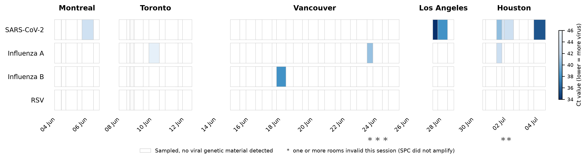
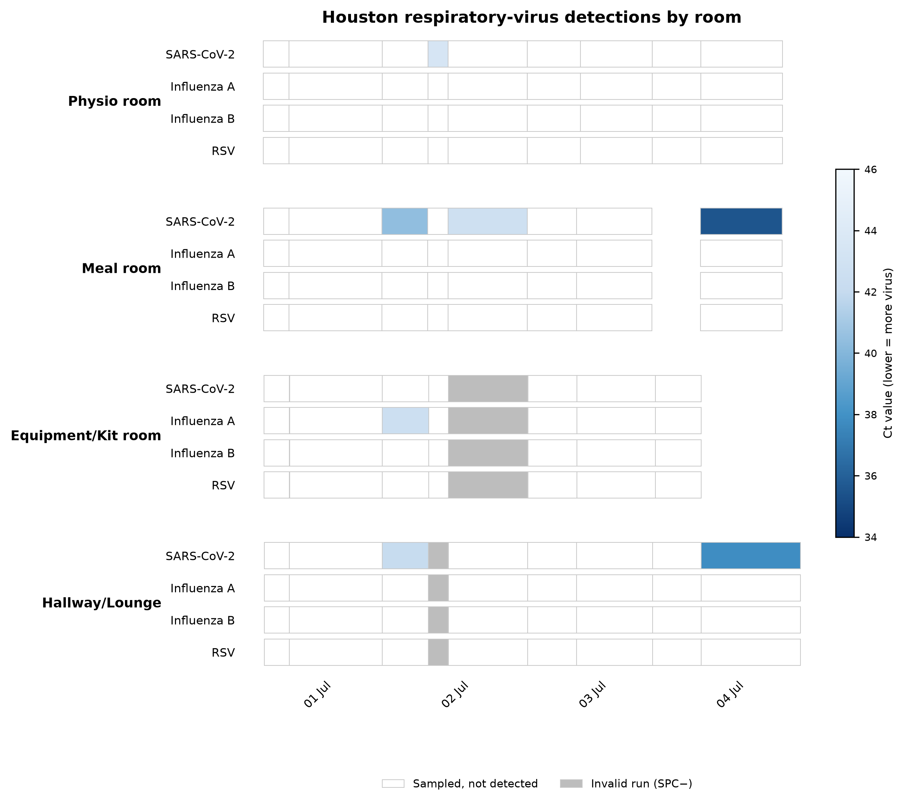
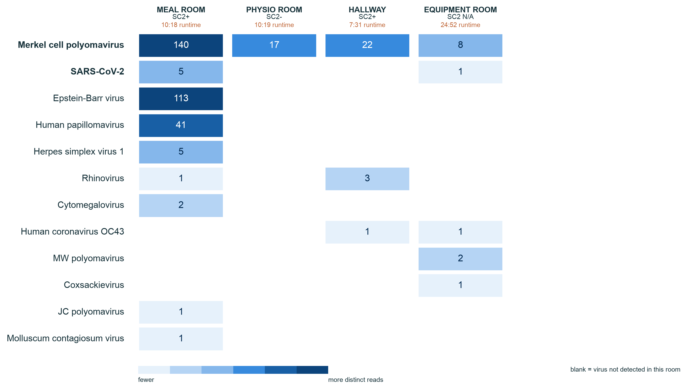
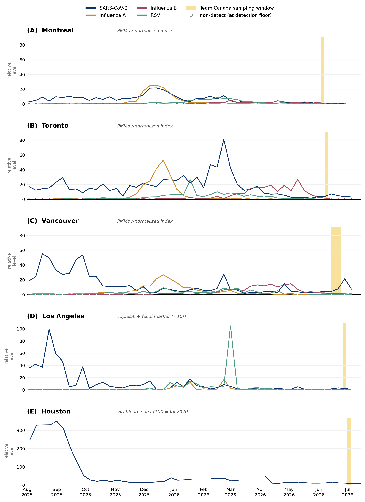

---
# title, subtitle, and keywords come from the Doc via _title.yml
# (metadata-files in _quarto.yml) — do not hard-code them here; edit the
# Google Doc. No date: the Doc carries none, so the title page shows none.
---





## Central figure

{fig-alt="Central figure: study workflow, detection timeline across the five host cities, and possible response actions."}







::: {#fig-detections}

```{=html}
<iframe src="analysis/figures/figure1_detections_interactive.html" width="100%" height="620"
        style="border:none;" loading="lazy"
        title="Figure 1: respiratory-virus detections across the World Cup"></iframe>
```

::: {.content-visible when-format="pdf"}

:::



:::



::: {#fig-houston}

```{=html}
<iframe src="analysis/figures/figure2_houston_interactive.html" width="100%" height="520"
        style="border:none;" loading="lazy"
        title="Figure 2: per-room detections during the Houston period"></iframe>
```

::: {.content-visible when-format="pdf"}

:::



:::



::: {#fig-sequencing}

```{=html}
<iframe src="analysis/figures/figure3_sequencing.html" width="100%" height="600"
        style="border:none;" loading="lazy"
        title="Figure 3: human viruses detected by sequencing of Houston air samples"></iframe>
```

::: {.content-visible when-format="pdf"}

:::



:::



## References



## Data and code

All data and analysis code for this study are openly available in the GitHub
repository <https://github.com/dholab/team-canada-world-cup-2026>.

The underlying dataset — one row per cartridge × target virus (728 rows: 182
respiratory cartridges × 4 targets) — and the script that builds every figure
are in the repository:

- Data: [`analysis/data/cartridges_long.csv`](https://github.com/dholab/team-canada-world-cup-2026/blob/main/analysis/data/cartridges_long.csv)
- Figures 1 and 2: [`analysis/make_figures_1_2_detections.py`](https://github.com/dholab/team-canada-world-cup-2026/blob/main/analysis/make_figures_1_2_detections.py)
- Figure 3 (sequencing): [`analysis/make_figure_3_sequencing.py`](https://github.com/dholab/team-canada-world-cup-2026/blob/main/analysis/make_figure_3_sequencing.py)
- Sequencing data for figure 3: [`analysis/data/sequencing_detections.csv`](https://github.com/dholab/team-canada-world-cup-2026/blob/main/analysis/data/sequencing_detections.csv)
- Online supplemental figure 1 (wastewater): [`analysis/make_supplement_1_wastewater.py`](https://github.com/dholab/team-canada-world-cup-2026/blob/main/analysis/make_supplement_1_wastewater.py)

Columns: `city, room, sampler, cartridge, start, end, dur_h, virus, ct, qual,
detected, spc, spc_ct, status`. A blank `ct` means the target did not amplify;
`detected = 1` marks a reported Ct regardless of the instrument's qualitative
call; `spc`/`spc_ct` are the internal sample-processing control's call and Ct;
`status` flags each cartridge as `valid` or `invalid`. The figures show valid
runs only, so invalid runs are drawn grey or marked with an asterisk rather than
plotted as results.

The wastewater comparison in [online supplemental figure 1](#supp-wastewater)
is built from per-city extracts of the public dashboards, committed alongside
the figure script so the figure is reproducible without re-downloading the large
source files:

- Canada (Montreal, Toronto, Vancouver): [`analysis/data/ww_canada.csv`](https://github.com/dholab/team-canada-world-cup-2026/blob/main/analysis/data/ww_canada.csv), from the [PHAC wastewater aggregate](https://health-infobase.canada.ca/src/data/wastewater/wastewater_aggregate.csv)
- Los Angeles (JWPCP): [`analysis/data/ww_losangeles.csv`](https://github.com/dholab/team-canada-world-cup-2026/blob/main/analysis/data/ww_losangeles.csv), from the California CDPH/NWSS open dataset
- Houston (69th Street): [`analysis/data/ww_houston.csv`](https://github.com/dholab/team-canada-world-cup-2026/blob/main/analysis/data/ww_houston.csv), from the Rice/HHD dashboard ArcGIS feature service

Each extract has columns `city, target, week, value, source, metric`; `target`
uses `covN2, fluA, fluB, rsv`; `metric` records which non-interchangeable
quantity that source reports (`pmmov_index`, `fecal_normalized`,
`houston_vl_index`).

## Supplemental material



::: {#supp-wastewater}

```{=html}
<iframe src="analysis/figures/supplement1_wastewater_interactive.html" width="100%" height="1180"
        style="border:none;" loading="lazy"
        title="Online supplemental figure 1, community wastewater context by host city"></iframe>
```

::: {.content-visible when-format="pdf"}
{fig-alt="Community wastewater surveillance context by host city." height="7.8in"}
:::



:::
