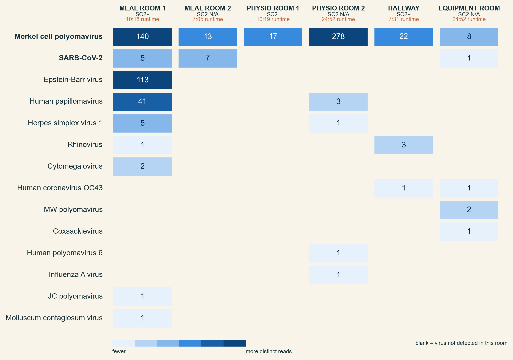

::: {.callout-note appearance="simple"}
This is the interactive version of the manuscript. The figures below are
explorable — hover for per-room, per-city detail. The prose is authored in
Google Docs and synced automatically; the figures are regenerated from the
committed data in [`analysis/`](https://github.com/dholab/team-canada-world-cup-2026/tree/main/analysis)
on every build. A [submission PDF](team-canada-air-sampling.pdf) with static
figures is produced from the same source.
:::

## Central figure

{fig-alt="Central figure: study workflow, detection timeline across the five host cities, and possible response actions."}

**Central figure. Air sampling for early detection of respiratory-virus threats
in an elite team during competition.** Continuous bioaerosol sampling ran in up
to four team congregate spaces per hotel (meal, equipment, physiotherapy, and
coaches' rooms); each cartridge's filter was eluted on-site and tested on a
Cepheid GeneXpert SARS-CoV-2/Flu/RSV cartridge (top). Across the five host
cities, viral genetic material was detected in team-hotel air in every city; the
timeline shows sampling coverage and each detection over the tournament
(middle). A positive air signal can trigger low-regret responses — masking,
portable air purifiers, distancing and reduced occupancy, far-UVC, reinforced
ventilation, and excluding visibly ill personnel (bottom).



## Figures

::: {#fig-detections}

```{=html}
<iframe src="analysis/figure1_interactive.html" width="100%" height="620"
        style="border:none;" loading="lazy"
        title="Figure 1: respiratory-virus detections across the World Cup"></iframe>
```

::: {.content-visible when-format="pdf"}

:::

**Respiratory-virus detections in team-space air samples across the
2026 FIFA World Cup.** Air was sampled continuously in Team Canada congregate
spaces across five host cities from 3 June to 4 July 2026, and every cartridge
was tested for SARS-CoV-2, influenza A, influenza B, and respiratory syncytial
virus (RSV). All cities are shown on a single continuous local-time axis. Rows
are the four target viruses; each rectangle is one cartridge tested for one
virus, drawn to that cartridge's exact sampling window. Rooms are merged within
each city, so each box summarises all rooms sampled in that session. A box is
blue if the virus was detected in any room, with fill mapped to the lowest
cycle-threshold (Ct) value across rooms; white if no room detected the virus
but at least one returned a valid negative result; grey if every room in that
session was invalid. An asterisk beneath the axis marks a session with partial
room validity. A sample counted as a detection if the instrument reported any
Ct value, regardless of qualitative call. The per-room data are explorable
above, and the Houston episode is shown by room in @fig-houston.

:::

::: {#fig-houston}

```{=html}
<iframe src="analysis/figure2_houston_interactive.html" width="100%" height="520"
        style="border:none;" loading="lazy"
        title="Figure 2: per-room detections during the Houston period"></iframe>
```

::: {.content-visible when-format="pdf"}

:::

**Per-room detections during the Houston sampling period.** Sampling
in Houston ran from the evening of 30 June to 4 July 2026 across four team
spaces (physiotherapy room, meal room, equipment room, and a team-occupied
hallway). Rows group the four target viruses within each room; the horizontal
axis is local wall-clock time. Each rectangle is one cartridge tested for one
virus, drawn to its exact sampling window. White boxes are valid negatives,
grey boxes are invalid runs, and blue boxes are detections, with fill mapped to
the Ct value. On 1 July, SARS-CoV-2 was detected in the meal room, the
physiotherapy room, and the hallway, and influenza A in the equipment room. No
virus was detected on 2 July. SARS-CoV-2 returned on 3–4 July at lower Ct, most
strongly in the meal room. The two invalid runs fell on 1 July.

:::

The same Houston episode was examined independently by metagenomic sequencing
(@fig-sequencing), which confirms the airborne SARS-CoV-2 and recovers
additional respiratory viruses that the GeneXpert panel does not target.

::: {#fig-sequencing}

```{=html}
<iframe src="analysis/figure3_sequencing.html" width="100%" height="600"
        style="border:none;" loading="lazy"
        title="Figure 3: human viruses detected by sequencing of Houston air samples"></iframe>
```

::: {.content-visible when-format="pdf"}

:::

**Human viruses detected by metagenomic sequencing of the Houston air
samples.** Six air cartridges from the Houston team spaces were pulled from the
samplers on the afternoon of 4 July 2026 and sequenced, and reads were
classified against a curated viral reference database with EsViritu. These
cartridges were collected the same day but are not the same cartridges tested on
the GeneXpert, so sequencing is an independent line of evidence for the viruses
present. Columns are the six sequenced samples, labelled by room, GeneXpert
SARS-CoV-2 status where a same-room result exists, and sampling runtime. Rows are
the human viruses detected, with Merkel cell polyomavirus and SARS-CoV-2 on top
and the rest ordered by total distinct reads. Each cell reports distinct
(deduplicated) reads for that virus in that sample, with fill mapped to that
count on a light-to-deep blue scale. A cell is left blank when the virus was not
detected in that sample, and SARS-CoV-2 was assessed in every sample. SARS-CoV-2 was recovered from both meal-room
samples and the equipment room, confirming the airborne SARS-CoV-2 seen in these
spaces on 4 July. Merkel cell polyomavirus, a commensal skin virus, was found in
every sample. Sequencing additionally recovered influenza A, human coronavirus
OC43, and rhinovirus, none of which are on the GeneXpert panel.

:::

## Data and code

The underlying dataset — one row per cartridge × target virus (728 rows: 182
respiratory cartridges × 4 targets) — and the script that builds every figure
are in the repository:

- Data: [`analysis/data/cartridges_long.csv`](https://github.com/dholab/team-canada-world-cup-2026/blob/main/analysis/data/cartridges_long.csv)
- Main-figure pipeline (Figures 1–2): [`analysis/make_figures.py`](https://github.com/dholab/team-canada-world-cup-2026/blob/main/analysis/make_figures.py)
- Supplemental-figure pipeline (online supplemental figure 1): [`analysis/make_figure3.py`](https://github.com/dholab/team-canada-world-cup-2026/blob/main/analysis/make_figure3.py)
- Sequencing figure (Figure 3): [`analysis/make_figure3_sequencing.py`](https://github.com/dholab/team-canada-world-cup-2026/blob/main/analysis/make_figure3_sequencing.py) with data [`analysis/data/sequencing_detections.csv`](https://github.com/dholab/team-canada-world-cup-2026/blob/main/analysis/data/sequencing_detections.csv)

Columns: `city, room, sampler, cartridge, start, end, dur_h, virus, ct, qual,
detected, spc, spc_ct, status`. A blank `ct` means the target did not amplify;
`detected = 1` marks a reported Ct regardless of the instrument's qualitative
call; `spc`/`spc_ct` are the internal sample-processing control's call and Ct;
`status` flags each cartridge as `valid` or `invalid`. The figures show valid
runs only, so invalid runs are drawn grey or marked with an asterisk rather than
plotted as results.

The wastewater comparison in [online supplemental figure 1](#supp-wastewater)
is built from per-city extracts of the public dashboards, committed alongside
the figure script so the figure is reproducible without re-downloading the large
source files:

- Canada (Montreal, Toronto, Vancouver): [`analysis/data/ww_canada.csv`](https://github.com/dholab/team-canada-world-cup-2026/blob/main/analysis/data/ww_canada.csv), from the [PHAC wastewater aggregate](https://health-infobase.canada.ca/src/data/wastewater/wastewater_aggregate.csv)
- Los Angeles (JWPCP): [`analysis/data/ww_losangeles.csv`](https://github.com/dholab/team-canada-world-cup-2026/blob/main/analysis/data/ww_losangeles.csv), from the California CDPH/NWSS open dataset
- Houston (69th Street): [`analysis/data/ww_houston.csv`](https://github.com/dholab/team-canada-world-cup-2026/blob/main/analysis/data/ww_houston.csv), from the Rice/HHD dashboard ArcGIS feature service

Each extract has columns `city, target, week, value, source, metric`; `target`
uses `covN2, fluA, fluB, rsv`; `metric` records which non-interchangeable
quantity that source reports (`pmmov_index`, `fecal_normalized`,
`houston_vl_index`).

## Supplemental material

::: {#supp-wastewater}

```{=html}
<iframe src="analysis/figure3_wastewater_interactive.html" width="100%" height="1180"
        style="border:none;" loading="lazy"
        title="Online supplemental figure 1, community wastewater context by host city"></iframe>
```

::: {.content-visible when-format="pdf"}
{fig-alt="Community wastewater surveillance context by host city."}
:::

**Online supplemental figure 1. Community wastewater surveillance context in
each host city over the 2025–2026 respiratory season.** Each panel (A to E) is
one host city, plotting publicly reported municipal wastewater levels for the
four study targets (SARS-CoV-2, influenza A, influenza B, and RSV, with the same
colour used for each virus in every panel) from August 2025 through mid-July
2026. The shaded gold band marks Team Canada's air-sampling window in that city,
widened to a minimum readable width for the shortest 1 to 2 day stays. **The four data sources report non-interchangeable quantities and are
therefore each shown on their own independent vertical axis. Levels must be read
within a panel and never compared between panels.** Panels A to C (Montreal,
Toronto, and Vancouver) use the Public Health Agency of Canada wastewater
aggregate (health-infobase), a PMMoV-normalized viral index, with the weekly
median taken across contributing sub-sites (Vancouver is reported as "Metro
Vancouver"). Open circles mark non-detections plotted at the source's
detection-limit substitution value. Panel D (Los Angeles) uses the California
open dataset (CDPH and CDC NWSS) for the Joint Water Pollution Control Plant in
Carson, which serves the Torrance area where the team stayed. Because that
source reports absolute concentrations, each target is self-normalized to fecal
load as copies/L divided by the reported human fecal marker concentration
(×10⁶), and influenza B was not reported at this plant during the season. Panel
E (Houston) uses the Rice University and Houston Health Department dashboard for
the 69th Street plant serving the downtown Main Street hotel, reporting the
published viral-load index for SARS-CoV-2 only at plant level, scaled so that
100 represents the July 2020 baseline. The dotted line and hatched band mark
that this public feed ends 22 June 2026, before the team's 30 June to 4 July
stay. Across all five cities the visit windows fall in the seasonal trough, at
or near each site's own lowest values of the season, indicating that no host
city, Canadian or US, was experiencing an unusually high level of community
respiratory-virus circulation while the team was present.

:::
